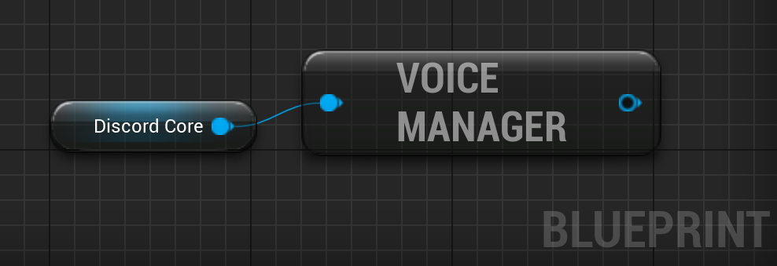
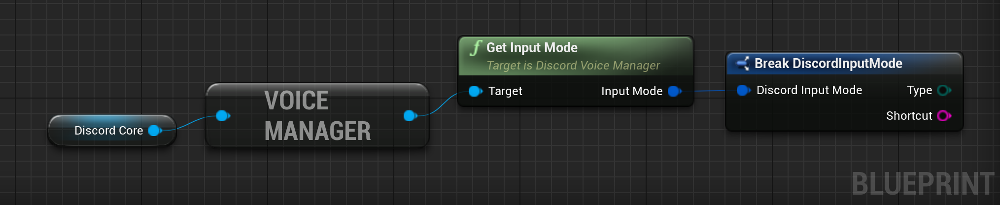
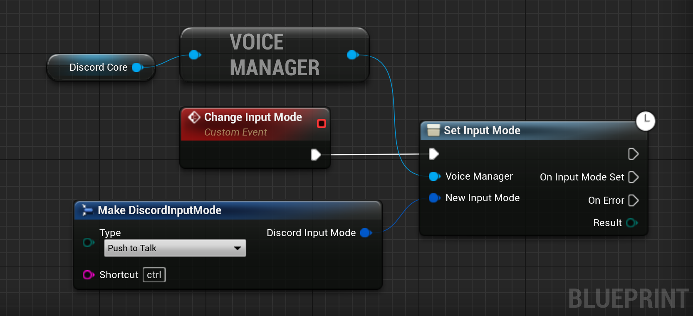

# Discord Game SDK

## Discord Voice

### Getting the Voice Manager
To use any part of the Discord Voice part of the SDK, we first need to get the manager:


<div class="code-switcher show-cpp-false">
<div class="switcher" >
<span class="sw-bp" onclick="switchBp()">Blueprints</span><span class="sw-cpp" onclick="switchCpp()">C++</span>
</div>
<div class="cpp">

```cpp
UDiscordVoiceManager* const VoiceManager = UDiscordVoiceManager::GetVoiceManager(DiscordCore);
```

</div>
<div class="bp">
<div class="bpcode">
<textarea readonly>
Begin Object Class=/Script/BlueprintGraph.K2Node_VariableGet Name="K2Node_VariableGet_4"
   VariableReference=(MemberName="Discord Core",MemberGuid=D83B7B5142C7BF0707857B8328644182,bSelfContext=True)
   NodePosX=-2944
   NodePosY=-7200
   NodeGuid=385CEB8A43490A99F6E731851454A39D
   CustomProperties Pin (PinId=B257E7F24F9AF6617270E2AF9C9E5791,PinName="Discord Core",Direction="EGPD_Output",PinType.PinCategory="object",PinType.PinSubCategory="",PinType.PinSubCategoryObject=Class'"/Script/DiscordCore.DiscordCore"',PinType.PinSubCategoryMemberReference=(),PinType.PinValueType=(),PinType.ContainerType=None,PinType.bIsReference=False,PinType.bIsConst=False,PinType.bIsWeakPointer=False,PinType.bIsUObjectWrapper=False,LinkedTo=(K2Node_CallFunction_52 2CAE5849440AC93BC3F60E993FD7F7DC,),PersistentGuid=00000000000000000000000000000000,bHidden=False,bNotConnectable=False,bDefaultValueIsReadOnly=False,bDefaultValueIsIgnored=False,bAdvancedView=False,bOrphanedPin=False,)
   CustomProperties Pin (PinId=9DCF95BA46EF3DFC0458E3A5AA86CA8D,PinName="self",PinFriendlyName=NSLOCTEXT("K2Node", "Target", "Target"),PinType.PinCategory="object",PinType.PinSubCategory="",PinType.PinSubCategoryObject=BlueprintGeneratedClass'"/Game/DemoActor.DemoActor_C"',PinType.PinSubCategoryMemberReference=(),PinType.PinValueType=(),PinType.ContainerType=None,PinType.bIsReference=False,PinType.bIsConst=False,PinType.bIsWeakPointer=False,PinType.bIsUObjectWrapper=False,PersistentGuid=00000000000000000000000000000000,bHidden=True,bNotConnectable=False,bDefaultValueIsReadOnly=False,bDefaultValueIsIgnored=False,bAdvancedView=False,bOrphanedPin=False,)
End Object
Begin Object Class=/Script/BlueprintGraph.K2Node_CallFunction Name="K2Node_CallFunction_52"
   bIsPureFunc=True
   FunctionReference=(MemberParent=Class'"/Script/DiscordVoice.DiscordVoiceManager"',MemberName="GetVoiceManager")
   NodePosX=-2784
   NodePosY=-7232
   NodeGuid=02F1A98644C0FF28CBBC33A219B94315
   CustomProperties Pin (PinId=A972979F4DFD62EE98D5D78AA153A03C,PinName="self",PinFriendlyName=NSLOCTEXT("K2Node", "Target", "Target"),PinToolTip="Target\nDiscord Voice Manager Object Reference",PinType.PinCategory="object",PinType.PinSubCategory="",PinType.PinSubCategoryObject=Class'"/Script/DiscordVoice.DiscordVoiceManager"',PinType.PinSubCategoryMemberReference=(),PinType.PinValueType=(),PinType.ContainerType=None,PinType.bIsReference=False,PinType.bIsConst=False,PinType.bIsWeakPointer=False,PinType.bIsUObjectWrapper=False,DefaultObject="/Script/DiscordVoice.Default__DiscordVoiceManager",PersistentGuid=00000000000000000000000000000000,bHidden=True,bNotConnectable=False,bDefaultValueIsReadOnly=False,bDefaultValueIsIgnored=False,bAdvancedView=False,bOrphanedPin=False,)
   CustomProperties Pin (PinId=2CAE5849440AC93BC3F60E993FD7F7DC,PinName="DiscordCore",PinToolTip="Discord Core\nDiscord Core Object Reference",PinType.PinCategory="object",PinType.PinSubCategory="",PinType.PinSubCategoryObject=Class'"/Script/DiscordCore.DiscordCore"',PinType.PinSubCategoryMemberReference=(),PinType.PinValueType=(),PinType.ContainerType=None,PinType.bIsReference=False,PinType.bIsConst=False,PinType.bIsWeakPointer=False,PinType.bIsUObjectWrapper=False,LinkedTo=(K2Node_VariableGet_4 B257E7F24F9AF6617270E2AF9C9E5791,),PersistentGuid=00000000000000000000000000000000,bHidden=False,bNotConnectable=False,bDefaultValueIsReadOnly=False,bDefaultValueIsIgnored=False,bAdvancedView=False,bOrphanedPin=False,)
   CustomProperties Pin (PinId=8772CBAD48EF029967FEBAAE4274FBD2,PinName="ReturnValue",PinFriendlyName="Voice Manager",PinToolTip="Voice Manager\nDiscord Voice Manager Object Reference\n\nGet Voice Manager",Direction="EGPD_Output",PinType.PinCategory="object",PinType.PinSubCategory="",PinType.PinSubCategoryObject=Class'"/Script/DiscordVoice.DiscordVoiceManager"',PinType.PinSubCategoryMemberReference=(),PinType.PinValueType=(),PinType.ContainerType=None,PinType.bIsReference=False,PinType.bIsConst=False,PinType.bIsWeakPointer=False,PinType.bIsUObjectWrapper=False,PersistentGuid=00000000000000000000000000000000,bHidden=False,bNotConnectable=False,bDefaultValueIsReadOnly=False,bDefaultValueIsIgnored=False,bAdvancedView=False,bOrphanedPin=False,)
End Object
</textarea>

<button onclick="copyBlueprintCode(this)">Copy Code</button>
</div>
</div>
</div>

### Getting the Input Mode

<div class="code-switcher show-cpp-false">
<div class="switcher" >
<span class="sw-bp" onclick="switchBp()">Blueprints</span><span class="sw-cpp" onclick="switchCpp()">C++</span>
</div>
<div class="cpp">

```cpp
FDiscordInputMode InputMode = VoiceManager->GetInputMode();
```

</div>
<div class="bp">
<div class="bpcode">
<textarea readonly>
Begin Object Class=/Script/BlueprintGraph.K2Node_VariableGet Name="K2Node_VariableGet_4"
   VariableReference=(MemberName="Discord Core",MemberGuid=D83B7B5142C7BF0707857B8328644182,bSelfContext=True)
   NodePosX=-2144
   NodePosY=-7536
   NodeGuid=385CEB8A43490A99F6E731851454A39D
   CustomProperties Pin (PinId=B257E7F24F9AF6617270E2AF9C9E5791,PinName="Discord Core",Direction="EGPD_Output",PinType.PinCategory="object",PinType.PinSubCategory="",PinType.PinSubCategoryObject=Class'"/Script/DiscordCore.DiscordCore"',PinType.PinSubCategoryMemberReference=(),PinType.PinValueType=(),PinType.ContainerType=None,PinType.bIsReference=False,PinType.bIsConst=False,PinType.bIsWeakPointer=False,PinType.bIsUObjectWrapper=False,LinkedTo=(K2Node_CallFunction_52 2CAE5849440AC93BC3F60E993FD7F7DC,),PersistentGuid=00000000000000000000000000000000,bHidden=False,bNotConnectable=False,bDefaultValueIsReadOnly=False,bDefaultValueIsIgnored=False,bAdvancedView=False,bOrphanedPin=False,)
   CustomProperties Pin (PinId=9DCF95BA46EF3DFC0458E3A5AA86CA8D,PinName="self",PinFriendlyName=NSLOCTEXT("K2Node", "Target", "Target"),PinType.PinCategory="object",PinType.PinSubCategory="",PinType.PinSubCategoryObject=BlueprintGeneratedClass'"/Game/DemoActor.DemoActor_C"',PinType.PinSubCategoryMemberReference=(),PinType.PinValueType=(),PinType.ContainerType=None,PinType.bIsReference=False,PinType.bIsConst=False,PinType.bIsWeakPointer=False,PinType.bIsUObjectWrapper=False,PersistentGuid=00000000000000000000000000000000,bHidden=True,bNotConnectable=False,bDefaultValueIsReadOnly=False,bDefaultValueIsIgnored=False,bAdvancedView=False,bOrphanedPin=False,)
End Object
Begin Object Class=/Script/BlueprintGraph.K2Node_CallFunction Name="K2Node_CallFunction_52"
   bIsPureFunc=True
   FunctionReference=(MemberParent=Class'"/Script/DiscordVoice.DiscordVoiceManager"',MemberName="GetVoiceManager")
   NodePosX=-1984
   NodePosY=-7568
   NodeGuid=02F1A98644C0FF28CBBC33A219B94315
   CustomProperties Pin (PinId=A972979F4DFD62EE98D5D78AA153A03C,PinName="self",PinFriendlyName=NSLOCTEXT("K2Node", "Target", "Target"),PinToolTip="Target\nDiscord Voice Manager Object Reference",PinType.PinCategory="object",PinType.PinSubCategory="",PinType.PinSubCategoryObject=Class'"/Script/DiscordVoice.DiscordVoiceManager"',PinType.PinSubCategoryMemberReference=(),PinType.PinValueType=(),PinType.ContainerType=None,PinType.bIsReference=False,PinType.bIsConst=False,PinType.bIsWeakPointer=False,PinType.bIsUObjectWrapper=False,DefaultObject="/Script/DiscordVoice.Default__DiscordVoiceManager",PersistentGuid=00000000000000000000000000000000,bHidden=True,bNotConnectable=False,bDefaultValueIsReadOnly=False,bDefaultValueIsIgnored=False,bAdvancedView=False,bOrphanedPin=False,)
   CustomProperties Pin (PinId=2CAE5849440AC93BC3F60E993FD7F7DC,PinName="DiscordCore",PinToolTip="Discord Core\nDiscord Core Object Reference",PinType.PinCategory="object",PinType.PinSubCategory="",PinType.PinSubCategoryObject=Class'"/Script/DiscordCore.DiscordCore"',PinType.PinSubCategoryMemberReference=(),PinType.PinValueType=(),PinType.ContainerType=None,PinType.bIsReference=False,PinType.bIsConst=False,PinType.bIsWeakPointer=False,PinType.bIsUObjectWrapper=False,LinkedTo=(K2Node_VariableGet_4 B257E7F24F9AF6617270E2AF9C9E5791,),PersistentGuid=00000000000000000000000000000000,bHidden=False,bNotConnectable=False,bDefaultValueIsReadOnly=False,bDefaultValueIsIgnored=False,bAdvancedView=False,bOrphanedPin=False,)
   CustomProperties Pin (PinId=8772CBAD48EF029967FEBAAE4274FBD2,PinName="ReturnValue",PinFriendlyName=NSLOCTEXT("", "9B9FCB1A474D028E9E19E09DAB370146", "Voice Manager"),PinToolTip="Voice Manager\nDiscord Voice Manager Object Reference\n\nGet Voice Manager",Direction="EGPD_Output",PinType.PinCategory="object",PinType.PinSubCategory="",PinType.PinSubCategoryObject=Class'"/Script/DiscordVoice.DiscordVoiceManager"',PinType.PinSubCategoryMemberReference=(),PinType.PinValueType=(),PinType.ContainerType=None,PinType.bIsReference=False,PinType.bIsConst=False,PinType.bIsWeakPointer=False,PinType.bIsUObjectWrapper=False,LinkedTo=(K2Node_CallFunction_54 725E6E8D4B3CF0CD101546A42E6DA60C,),PersistentGuid=00000000000000000000000000000000,bHidden=False,bNotConnectable=False,bDefaultValueIsReadOnly=False,bDefaultValueIsIgnored=False,bAdvancedView=False,bOrphanedPin=False,)
End Object
Begin Object Class=/Script/BlueprintGraph.K2Node_CallFunction Name="K2Node_CallFunction_54"
   bIsPureFunc=True
   FunctionReference=(MemberParent=Class'"/Script/DiscordVoice.DiscordVoiceManager"',MemberName="GetInputMode")
   NodePosX=-1728
   NodePosY=-7616
   NodeGuid=2038913F4080D59D34C3BFAA2404A695
   CustomProperties Pin (PinId=725E6E8D4B3CF0CD101546A42E6DA60C,PinName="self",PinFriendlyName=NSLOCTEXT("K2Node", "Target", "Target"),PinToolTip="Target\nDiscord Voice Manager Object Reference",PinType.PinCategory="object",PinType.PinSubCategory="",PinType.PinSubCategoryObject=Class'"/Script/DiscordVoice.DiscordVoiceManager"',PinType.PinSubCategoryMemberReference=(),PinType.PinValueType=(),PinType.ContainerType=None,PinType.bIsReference=False,PinType.bIsConst=False,PinType.bIsWeakPointer=False,PinType.bIsUObjectWrapper=False,LinkedTo=(K2Node_CallFunction_52 8772CBAD48EF029967FEBAAE4274FBD2,),PersistentGuid=00000000000000000000000000000000,bHidden=False,bNotConnectable=False,bDefaultValueIsReadOnly=False,bDefaultValueIsIgnored=False,bAdvancedView=False,bOrphanedPin=False,)
   CustomProperties Pin (PinId=7C61490E4FB44B21C76427A81522B348,PinName="ReturnValue",PinFriendlyName="Input Mode",PinToolTip="Input Mode\nDiscord Input Mode Structure\n\nGet the current voice input mode for the user.",Direction="EGPD_Output",PinType.PinCategory="struct",PinType.PinSubCategory="",PinType.PinSubCategoryObject=ScriptStruct'"/Script/DiscordVoice.DiscordInputMode"',PinType.PinSubCategoryMemberReference=(),PinType.PinValueType=(),PinType.ContainerType=None,PinType.bIsReference=False,PinType.bIsConst=False,PinType.bIsWeakPointer=False,PinType.bIsUObjectWrapper=False,LinkedTo=(K2Node_BreakStruct_9 6FABF7AF4A6DCB921ECE6EA604F78A91,),PersistentGuid=00000000000000000000000000000000,bHidden=False,bNotConnectable=False,bDefaultValueIsReadOnly=False,bDefaultValueIsIgnored=False,bAdvancedView=False,bOrphanedPin=False,)
End Object
Begin Object Class=/Script/BlueprintGraph.K2Node_BreakStruct Name="K2Node_BreakStruct_9"
   ShowPinForProperties(0)=(PropertyName="Type",PropertyFriendlyName="Type",PropertyTooltip="Set either VAD or PTT as the voice input mode",CategoryName="Discord|Voice",bShowPin=True,bCanToggleVisibility=True)
   ShowPinForProperties(1)=(PropertyName="Shortcut",PropertyFriendlyName="Shortcut",PropertyTooltip="The PTT hotkey for the user",CategoryName="Discord|Voice",bShowPin=True,bCanToggleVisibility=True)
   StructType=ScriptStruct'"/Script/DiscordVoice.DiscordInputMode"'
   NodePosX=-1456
   NodePosY=-7600
   NodeGuid=7AD7F7E4432AABA5A6BBA685797DFE8B
   CustomProperties Pin (PinId=6FABF7AF4A6DCB921ECE6EA604F78A91,PinName="DiscordInputMode",PinType.PinCategory="struct",PinType.PinSubCategory="",PinType.PinSubCategoryObject=ScriptStruct'"/Script/DiscordVoice.DiscordInputMode"',PinType.PinSubCategoryMemberReference=(),PinType.PinValueType=(),PinType.ContainerType=None,PinType.bIsReference=True,PinType.bIsConst=True,PinType.bIsWeakPointer=False,PinType.bIsUObjectWrapper=False,LinkedTo=(K2Node_CallFunction_54 7C61490E4FB44B21C76427A81522B348,),PersistentGuid=00000000000000000000000000000000,bHidden=False,bNotConnectable=False,bDefaultValueIsReadOnly=False,bDefaultValueIsIgnored=False,bAdvancedView=False,bOrphanedPin=False,)
   CustomProperties Pin (PinId=AC2325E24C278968F4C16084222C6307,PinName="Type",PinFriendlyName="Type",PinToolTip="Type\nEDiscordInputModeType Enum\n\nSet either VAD or PTT as the voice input mode",Direction="EGPD_Output",PinType.PinCategory="byte",PinType.PinSubCategory="",PinType.PinSubCategoryObject=Enum'"/Script/DiscordVoice.EDiscordInputModeType"',PinType.PinSubCategoryMemberReference=(),PinType.PinValueType=(),PinType.ContainerType=None,PinType.bIsReference=False,PinType.bIsConst=False,PinType.bIsWeakPointer=False,PinType.bIsUObjectWrapper=False,PersistentGuid=00000000000000000000000000000000,bHidden=False,bNotConnectable=False,bDefaultValueIsReadOnly=False,bDefaultValueIsIgnored=False,bAdvancedView=False,bOrphanedPin=False,)
   CustomProperties Pin (PinId=3DFDABF44176B12DB7600FA5D971EDE3,PinName="Shortcut",PinFriendlyName="Shortcut",PinToolTip="Shortcut\nString\n\nThe PTT hotkey for the user",Direction="EGPD_Output",PinType.PinCategory="string",PinType.PinSubCategory="",PinType.PinSubCategoryObject=None,PinType.PinSubCategoryMemberReference=(),PinType.PinValueType=(),PinType.ContainerType=None,PinType.bIsReference=False,PinType.bIsConst=False,PinType.bIsWeakPointer=False,PinType.bIsUObjectWrapper=False,PersistentGuid=00000000000000000000000000000000,bHidden=False,bNotConnectable=False,bDefaultValueIsReadOnly=False,bDefaultValueIsIgnored=False,bAdvancedView=False,bOrphanedPin=False,)
End Object
</textarea>

<button onclick="copyBlueprintCode(this)">Copy Code</button>
</div>
</div>
</div>

### Setting the Input Mode

<div class="code-switcher show-cpp-false">
<div class="switcher" >
<span class="sw-bp" onclick="switchBp()">Blueprints</span><span class="sw-cpp" onclick="switchCpp()">C++</span>
</div>
<div class="cpp">

```cpp
// C++ code sample not available yet.
```

</div>
<div class="bp">
<div class="bpcode">
<textarea readonly>
Begin Object Class=/Script/BlueprintGraph.K2Node_VariableGet Name="K2Node_VariableGet_5"
   VariableReference=(MemberName="Discord Core",MemberGuid=D83B7B5142C7BF0707857B8328644182,bSelfContext=True)
   NodePosX=-2112
   NodePosY=-7808
   NodeGuid=385CEB8A43490A99F6E731851454A39D
   CustomProperties Pin (PinId=B257E7F24F9AF6617270E2AF9C9E5791,PinName="Discord Core",Direction="EGPD_Output",PinType.PinCategory="object",PinType.PinSubCategory="",PinType.PinSubCategoryObject=Class'"/Script/DiscordCore.DiscordCore"',PinType.PinSubCategoryMemberReference=(),PinType.PinValueType=(),PinType.ContainerType=None,PinType.bIsReference=False,PinType.bIsConst=False,PinType.bIsWeakPointer=False,PinType.bIsUObjectWrapper=False,LinkedTo=(K2Node_CallFunction_55 2CAE5849440AC93BC3F60E993FD7F7DC,),PersistentGuid=00000000000000000000000000000000,bHidden=False,bNotConnectable=False,bDefaultValueIsReadOnly=False,bDefaultValueIsIgnored=False,bAdvancedView=False,bOrphanedPin=False,)
   CustomProperties Pin (PinId=9DCF95BA46EF3DFC0458E3A5AA86CA8D,PinName="self",PinFriendlyName=NSLOCTEXT("K2Node", "Target", "Target"),PinType.PinCategory="object",PinType.PinSubCategory="",PinType.PinSubCategoryObject=BlueprintGeneratedClass'"/Game/DemoActor.DemoActor_C"',PinType.PinSubCategoryMemberReference=(),PinType.PinValueType=(),PinType.ContainerType=None,PinType.bIsReference=False,PinType.bIsConst=False,PinType.bIsWeakPointer=False,PinType.bIsUObjectWrapper=False,PersistentGuid=00000000000000000000000000000000,bHidden=True,bNotConnectable=False,bDefaultValueIsReadOnly=False,bDefaultValueIsIgnored=False,bAdvancedView=False,bOrphanedPin=False,)
End Object
Begin Object Class=/Script/BlueprintGraph.K2Node_CallFunction Name="K2Node_CallFunction_55"
   bIsPureFunc=True
   FunctionReference=(MemberParent=Class'"/Script/DiscordVoice.DiscordVoiceManager"',MemberName="GetVoiceManager")
   NodePosX=-1952
   NodePosY=-7840
   NodeGuid=02F1A98644C0FF28CBBC33A219B94315
   CustomProperties Pin (PinId=A972979F4DFD62EE98D5D78AA153A03C,PinName="self",PinFriendlyName=NSLOCTEXT("K2Node", "Target", "Target"),PinToolTip="Target\nDiscord Voice Manager Object Reference",PinType.PinCategory="object",PinType.PinSubCategory="",PinType.PinSubCategoryObject=Class'"/Script/DiscordVoice.DiscordVoiceManager"',PinType.PinSubCategoryMemberReference=(),PinType.PinValueType=(),PinType.ContainerType=None,PinType.bIsReference=False,PinType.bIsConst=False,PinType.bIsWeakPointer=False,PinType.bIsUObjectWrapper=False,DefaultObject="/Script/DiscordVoice.Default__DiscordVoiceManager",PersistentGuid=00000000000000000000000000000000,bHidden=True,bNotConnectable=False,bDefaultValueIsReadOnly=False,bDefaultValueIsIgnored=False,bAdvancedView=False,bOrphanedPin=False,)
   CustomProperties Pin (PinId=2CAE5849440AC93BC3F60E993FD7F7DC,PinName="DiscordCore",PinToolTip="Discord Core\nDiscord Core Object Reference",PinType.PinCategory="object",PinType.PinSubCategory="",PinType.PinSubCategoryObject=Class'"/Script/DiscordCore.DiscordCore"',PinType.PinSubCategoryMemberReference=(),PinType.PinValueType=(),PinType.ContainerType=None,PinType.bIsReference=False,PinType.bIsConst=False,PinType.bIsWeakPointer=False,PinType.bIsUObjectWrapper=False,LinkedTo=(K2Node_VariableGet_5 B257E7F24F9AF6617270E2AF9C9E5791,),PersistentGuid=00000000000000000000000000000000,bHidden=False,bNotConnectable=False,bDefaultValueIsReadOnly=False,bDefaultValueIsIgnored=False,bAdvancedView=False,bOrphanedPin=False,)
   CustomProperties Pin (PinId=8772CBAD48EF029967FEBAAE4274FBD2,PinName="ReturnValue",PinFriendlyName=NSLOCTEXT("", "9B9FCB1A474D028E9E19E09DAB370146", "Voice Manager"),PinToolTip="Voice Manager\nDiscord Voice Manager Object Reference\n\nGet Voice Manager",Direction="EGPD_Output",PinType.PinCategory="object",PinType.PinSubCategory="",PinType.PinSubCategoryObject=Class'"/Script/DiscordVoice.DiscordVoiceManager"',PinType.PinSubCategoryMemberReference=(),PinType.PinValueType=(),PinType.ContainerType=None,PinType.bIsReference=False,PinType.bIsConst=False,PinType.bIsWeakPointer=False,PinType.bIsUObjectWrapper=False,LinkedTo=(K2Node_AsyncAction_18 C9CBC12A40DE51C24F199489FF304F0C,),PersistentGuid=00000000000000000000000000000000,bHidden=False,bNotConnectable=False,bDefaultValueIsReadOnly=False,bDefaultValueIsIgnored=False,bAdvancedView=False,bOrphanedPin=False,)
End Object
Begin Object Class=/Script/BlueprintGraph.K2Node_AsyncAction Name="K2Node_AsyncAction_18"
   ProxyFactoryFunctionName="SetInputMode"
   ProxyFactoryClass=Class'"/Script/DiscordVoice.VoiceSetInputModeProxy"'
   ProxyClass=Class'"/Script/DiscordVoice.VoiceSetInputModeProxy"'
   NodePosX=-1664
   NodePosY=-7728
   NodeGuid=8E080646444DC9D0BECC35A370587649
   CustomProperties Pin (PinId=B6FD1E1B49F6B006376226B0A06EBEE0,PinName="execute",PinToolTip="\nExec",PinType.PinCategory="exec",PinType.PinSubCategory="",PinType.PinSubCategoryObject=None,PinType.PinSubCategoryMemberReference=(),PinType.PinValueType=(),PinType.ContainerType=None,PinType.bIsReference=False,PinType.bIsConst=False,PinType.bIsWeakPointer=False,PinType.bIsUObjectWrapper=False,LinkedTo=(K2Node_CustomEvent_11 AF75DA764B1D472529653B8ECF222D11,),PersistentGuid=00000000000000000000000000000000,bHidden=False,bNotConnectable=False,bDefaultValueIsReadOnly=False,bDefaultValueIsIgnored=False,bAdvancedView=False,bOrphanedPin=False,)
   CustomProperties Pin (PinId=738F993C480135E9B668DB8F640ED47F,PinName="then",Direction="EGPD_Output",PinType.PinCategory="exec",PinType.PinSubCategory="",PinType.PinSubCategoryObject=None,PinType.PinSubCategoryMemberReference=(),PinType.PinValueType=(),PinType.ContainerType=None,PinType.bIsReference=False,PinType.bIsConst=False,PinType.bIsWeakPointer=False,PinType.bIsUObjectWrapper=False,PersistentGuid=00000000000000000000000000000000,bHidden=False,bNotConnectable=False,bDefaultValueIsReadOnly=False,bDefaultValueIsIgnored=False,bAdvancedView=False,bOrphanedPin=False,)
   CustomProperties Pin (PinId=FF766BE64D0C3342D95451A97B9DD161,PinName="OnInputModeSet",PinFriendlyName="On Input Mode Set",PinToolTip="On Input Mode Set",Direction="EGPD_Output",PinType.PinCategory="exec",PinType.PinSubCategory="",PinType.PinSubCategoryObject=None,PinType.PinSubCategoryMemberReference=(),PinType.PinValueType=(),PinType.ContainerType=None,PinType.bIsReference=False,PinType.bIsConst=False,PinType.bIsWeakPointer=False,PinType.bIsUObjectWrapper=False,PersistentGuid=00000000000000000000000000000000,bHidden=False,bNotConnectable=False,bDefaultValueIsReadOnly=False,bDefaultValueIsIgnored=False,bAdvancedView=False,bOrphanedPin=False,)
   CustomProperties Pin (PinId=765EFB634D9B3C337C5EA7A6A06DCA63,PinName="OnError",PinFriendlyName="On Error",PinToolTip="On Error",Direction="EGPD_Output",PinType.PinCategory="exec",PinType.PinSubCategory="",PinType.PinSubCategoryObject=None,PinType.PinSubCategoryMemberReference=(),PinType.PinValueType=(),PinType.ContainerType=None,PinType.bIsReference=False,PinType.bIsConst=False,PinType.bIsWeakPointer=False,PinType.bIsUObjectWrapper=False,PersistentGuid=00000000000000000000000000000000,bHidden=False,bNotConnectable=False,bDefaultValueIsReadOnly=False,bDefaultValueIsIgnored=False,bAdvancedView=False,bOrphanedPin=False,)
   CustomProperties Pin (PinId=EB5341BE4289769128C50DB72E972051,PinName="Result",PinToolTip="Result",Direction="EGPD_Output",PinType.PinCategory="byte",PinType.PinSubCategory="",PinType.PinSubCategoryObject=Enum'"/Script/DiscordCore.EDiscordResult"',PinType.PinSubCategoryMemberReference=(),PinType.PinValueType=(),PinType.ContainerType=None,PinType.bIsReference=False,PinType.bIsConst=False,PinType.bIsWeakPointer=False,PinType.bIsUObjectWrapper=False,PersistentGuid=00000000000000000000000000000000,bHidden=False,bNotConnectable=False,bDefaultValueIsReadOnly=False,bDefaultValueIsIgnored=False,bAdvancedView=False,bOrphanedPin=False,)
   CustomProperties Pin (PinId=C9CBC12A40DE51C24F199489FF304F0C,PinName="VoiceManager",PinToolTip="Voice Manager\nDiscord Voice Manager Object Reference",PinType.PinCategory="object",PinType.PinSubCategory="",PinType.PinSubCategoryObject=Class'"/Script/DiscordVoice.DiscordVoiceManager"',PinType.PinSubCategoryMemberReference=(),PinType.PinValueType=(),PinType.ContainerType=None,PinType.bIsReference=False,PinType.bIsConst=False,PinType.bIsWeakPointer=False,PinType.bIsUObjectWrapper=False,LinkedTo=(K2Node_CallFunction_55 8772CBAD48EF029967FEBAAE4274FBD2,),PersistentGuid=00000000000000000000000000000000,bHidden=False,bNotConnectable=False,bDefaultValueIsReadOnly=False,bDefaultValueIsIgnored=False,bAdvancedView=False,bOrphanedPin=False,)
   CustomProperties Pin (PinId=F6A7894E49EDC2067BB4729B6EA90231,PinName="NewInputMode",PinToolTip="New Input Mode\nDiscord Input Mode Structure (by ref)",PinType.PinCategory="struct",PinType.PinSubCategory="",PinType.PinSubCategoryObject=ScriptStruct'"/Script/DiscordVoice.DiscordInputMode"',PinType.PinSubCategoryMemberReference=(),PinType.PinValueType=(),PinType.ContainerType=None,PinType.bIsReference=True,PinType.bIsConst=True,PinType.bIsWeakPointer=False,PinType.bIsUObjectWrapper=False,LinkedTo=(K2Node_MakeStruct_21 F329704C4E7E1FF26BFC4EBA3DA1AB10,),PersistentGuid=00000000000000000000000000000000,bHidden=False,bNotConnectable=False,bDefaultValueIsReadOnly=False,bDefaultValueIsIgnored=True,bAdvancedView=False,bOrphanedPin=False,)
End Object
Begin Object Class=/Script/BlueprintGraph.K2Node_MakeStruct Name="K2Node_MakeStruct_21"
   bMadeAfterOverridePinRemoval=True
   ShowPinForProperties(0)=(PropertyName="Type",PropertyFriendlyName="Type",PropertyTooltip="Set either VAD or PTT as the voice input mode",CategoryName="Discord|Voice",bShowPin=True,bCanToggleVisibility=True)
   ShowPinForProperties(1)=(PropertyName="Shortcut",PropertyFriendlyName="Shortcut",PropertyTooltip="The PTT hotkey for the user",CategoryName="Discord|Voice",bShowPin=True,bCanToggleVisibility=True)
   StructType=ScriptStruct'"/Script/DiscordVoice.DiscordInputMode"'
   NodePosX=-2080
   NodePosY=-7632
   NodeGuid=3ADAA40F4CCE39CDB9C3D0A1ABAA2CE5
   CustomProperties Pin (PinId=F329704C4E7E1FF26BFC4EBA3DA1AB10,PinName="DiscordInputMode",Direction="EGPD_Output",PinType.PinCategory="struct",PinType.PinSubCategory="",PinType.PinSubCategoryObject=ScriptStruct'"/Script/DiscordVoice.DiscordInputMode"',PinType.PinSubCategoryMemberReference=(),PinType.PinValueType=(),PinType.ContainerType=None,PinType.bIsReference=False,PinType.bIsConst=False,PinType.bIsWeakPointer=False,PinType.bIsUObjectWrapper=False,LinkedTo=(K2Node_AsyncAction_18 F6A7894E49EDC2067BB4729B6EA90231,),PersistentGuid=00000000000000000000000000000000,bHidden=False,bNotConnectable=False,bDefaultValueIsReadOnly=False,bDefaultValueIsIgnored=False,bAdvancedView=False,bOrphanedPin=False,)
   CustomProperties Pin (PinId=97801648429B82520B6E998CC096A4D4,PinName="Type",PinFriendlyName="Type",PinToolTip="Type\nEDiscordInputModeType Enum\n\nSet either VAD or PTT as the voice input mode",PinType.PinCategory="byte",PinType.PinSubCategory="",PinType.PinSubCategoryObject=Enum'"/Script/DiscordVoice.EDiscordInputModeType"',PinType.PinSubCategoryMemberReference=(),PinType.PinValueType=(),PinType.ContainerType=None,PinType.bIsReference=False,PinType.bIsConst=False,PinType.bIsWeakPointer=False,PinType.bIsUObjectWrapper=False,DefaultValue="PushToTalk",AutogeneratedDefaultValue="VoiceActivity",PersistentGuid=00000000000000000000000000000000,bHidden=False,bNotConnectable=False,bDefaultValueIsReadOnly=False,bDefaultValueIsIgnored=False,bAdvancedView=False,bOrphanedPin=False,)
   CustomProperties Pin (PinId=6FAF0D46460272736415C6BFFE9BE186,PinName="Shortcut",PinFriendlyName="Shortcut",PinToolTip="Shortcut\nString\n\nThe PTT hotkey for the user",PinType.PinCategory="string",PinType.PinSubCategory="",PinType.PinSubCategoryObject=None,PinType.PinSubCategoryMemberReference=(),PinType.PinValueType=(),PinType.ContainerType=None,PinType.bIsReference=False,PinType.bIsConst=False,PinType.bIsWeakPointer=False,PinType.bIsUObjectWrapper=False,DefaultValue="ctrl",PersistentGuid=00000000000000000000000000000000,bHidden=False,bNotConnectable=False,bDefaultValueIsReadOnly=False,bDefaultValueIsIgnored=False,bAdvancedView=False,bOrphanedPin=False,)
End Object
Begin Object Class=/Script/BlueprintGraph.K2Node_CustomEvent Name="K2Node_CustomEvent_11"
   CustomFunctionName="Change Input Mode"
   NodePosX=-1952
   NodePosY=-7744
   NodeGuid=F3979B534184040FD360AB817CEBB5B0
   CustomProperties Pin (PinId=449CD5484CBD00BFBA0F3F9BE4E32F6F,PinName="OutputDelegate",Direction="EGPD_Output",PinType.PinCategory="delegate",PinType.PinSubCategory="",PinType.PinSubCategoryObject=None,PinType.PinSubCategoryMemberReference=(),PinType.PinValueType=(),PinType.ContainerType=None,PinType.bIsReference=False,PinType.bIsConst=False,PinType.bIsWeakPointer=False,PinType.bIsUObjectWrapper=False,PersistentGuid=00000000000000000000000000000000,bHidden=False,bNotConnectable=False,bDefaultValueIsReadOnly=False,bDefaultValueIsIgnored=False,bAdvancedView=False,bOrphanedPin=False,)
   CustomProperties Pin (PinId=AF75DA764B1D472529653B8ECF222D11,PinName="then",Direction="EGPD_Output",PinType.PinCategory="exec",PinType.PinSubCategory="",PinType.PinSubCategoryObject=None,PinType.PinSubCategoryMemberReference=(),PinType.PinValueType=(),PinType.ContainerType=None,PinType.bIsReference=False,PinType.bIsConst=False,PinType.bIsWeakPointer=False,PinType.bIsUObjectWrapper=False,LinkedTo=(K2Node_AsyncAction_18 B6FD1E1B49F6B006376226B0A06EBEE0,),PersistentGuid=00000000000000000000000000000000,bHidden=False,bNotConnectable=False,bDefaultValueIsReadOnly=False,bDefaultValueIsIgnored=False,bAdvancedView=False,bOrphanedPin=False,)
End Object
</textarea>

<button onclick="copyBlueprintCode(this)">Copy Code</button>
</div>
</div>
</div>

</br>
</br>

# Examples
## Blueprint Examples
### Creating the Core
Creating the core is the starting point when you plan to integrate Discord in you game.


!> Make sure the Discord Core doesn't get garbage collected! The Core keeps a hard reference to the managers. 
The managers are valid while the Core is not garbage collected.

!> If you run this code in editor without Discord in background, the Editor will close and launch Discord.
### Rich Presence
Rich Presence is really easy to implement: 

### Create a Lobby

##  C++ Examples
### Creating the Core
```cpp
UDiscordCore* DiscordCore = UDiscordCore::CreateDiscordCore(EDiscordCoreCreationFlags::Default);
if (DiscordCore)
{
    // We have a valid Discord Core !
    // We should keep it as a UPROPERTY() to prevent it
    // from being garbage collected...
}
```
### Rich Presence
```cpp
UDiscordActivityManager* ActivityManager = UDiscordActivityManager::GetActivityManager(DiscordCore);
if (ActivityManager)
{
    FDiscordActivity Activity;
    Activity.State   = TEXT("In a dungeon...");
    Activity.Details = TEXT("Slaying monsters !");
    
    ActivityManager->UpdateActivity(Activity, FDiscordResultCallback::CreateLambda([](EDiscordResult Result) 
    {
        if (Result == EDiscordResult::Ok)
        {
            // Activity has been updated !
        }
        else
        {
            // An error occured !
        }
    }));
}
```
### Create a Lobby
```cpp

UDiscordLobbyManager* LobbyManager = UDiscordLobbyManager::GetLobbyManager(DiscordCore);
UDiscordUserManager*  UserManager  = UDiscordUserManager::GetUserManager(DiscordCore);
if (LobbyManager && UserManager)
{
    const FDiscordUser User = UserManager->GetCurrentUser();
    
    FDiscordLobbyTransaction Transaction = LobbyManager->GetLobbyCreateTransaction();
    Transaction.SetCapacity(10);
    Transaction.SetLocked(false);
    Transaction.SetMetadata(TEXT("SomeKey"), TEXT("SomeValue"));
    Transaction.SetOwner(User.Id);
    Transaction.SetType(EDiscordLobbyType::Private);

    LobbyManager->CreateLobby(Transaction, FLobbyCallback::CreateLambda([](EDiscordResult Result, FDiscordLobby& Lobby)
    {
        if (Result == EDiscordResult::Ok)
        {
            // Lobby created.
        }
        else
        {
            // An error occured !
        }
    }));
}
```